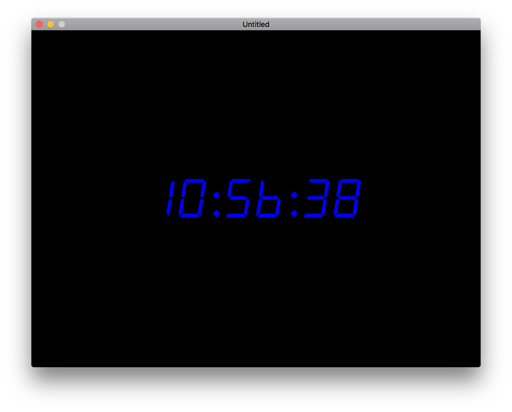

# simple digital clock for raspberrypi zero

Uses love2d

To run:
cd <DIRECTORY YOU INSTALLED THE CODE>
love .

## dependencies
sudo apt-get install love

uses this font: https://www.dafont.com/alarm-clock.font

What it looks like (in a window)

